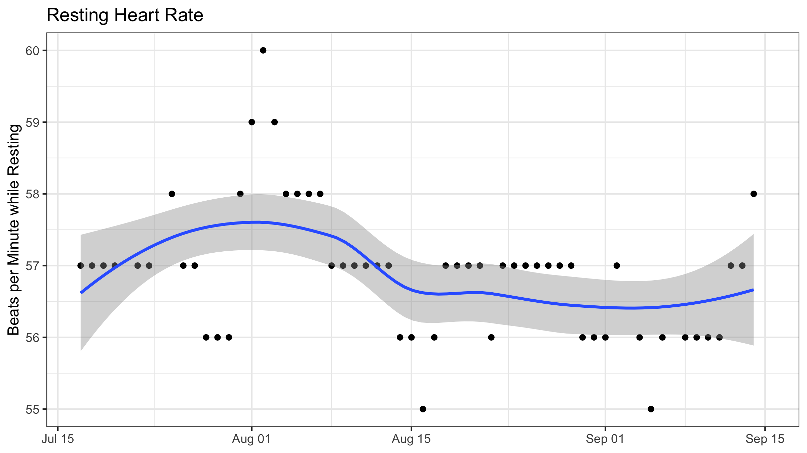

```{r setup, include=FALSE}
usethis::use_git_ignore(c("*.csv", "*.rds"))
options(htmltools.dir.version = FALSE)

library(knitr)
library(tidyverse)
library(xaringan)
library(fontawesome)
```

class: inverse, center, middle

# `r fa("far fa-images", fill = "#fff")`

**View the slides:** 

[bretsw.github.io/eme6356-ss22-module2](https://bretsw.github.io/eme6356-ss22-module2)

---

# Data stories

```{r, out.width = "300px", echo = FALSE, fig.align = "center"}
include_graphics("img/2-data-story-tweet-1.jpg")
```

(Tweet from [@alvinfoo](https://twitter.com/alvinfoo/status/1431458670684954629))

---

# Data vulnerability

```{r, out.width = "420px", echo = FALSE, fig.align = "center"}

```

(Tweet from [@josephfcox](https://twitter.com/josephfcox/status/1481628964632379397))

---

class: inverse, center, middle

# `r fa("thumbs-up", fill = "#fff")` <br> <br> Module 1 Discussion  <br> Themes and Kudos

---

class: inverse, center, middle

# `r fa("fas fa-question", fill = "#fff")` <br> <br> Module 1 Discussion  <br> Final Thoughts?

---

class: inverse, center, middle

# `r fa("fas fa-chart-line", fill = "#fff")` <br> <br> Module 2: <br> Performance Analytics

---

class: inverse, center, middle

# `r fa("fas fa-chart-line", fill = "#fff")` <br> <br> **Defining Analytics**

---

class: inverse, left, middle

# Analytics:

---

class: inverse, left, middle

# Analytics:

### Measure

---

class: inverse, left, middle

# Analytics:

### Measure `r fa("fas fa-arrow-right", fill = "#fff")` Collect

---

class: inverse, left, middle

# Analytics:

### Measure `r fa("fas fa-arrow-right", fill = "#fff")` Collect `r fa("fas fa-arrow-right", fill = "#fff")` Analyze

---

class: inverse, left, middle

# Analytics:

### Measure `r fa("fas fa-arrow-right", fill = "#fff")` Collect `r fa("fas fa-arrow-right", fill = "#fff")` Analyze `r fa("fas fa-arrow-right", fill = "#fff")` Report

---

class: inverse, center, middle

# `r fa("fas fa-chart-line", fill = "#fff")` <br> <br> **Performance at Home**

---

# Performance at Home

```{r, out.width = "480px", echo = FALSE, fig.align = "center"}

```

Measure `r fa("fas fa-arrow-right", fill = "#782F40")` Collect `r fa("fas fa-arrow-right", fill = "#782F40")` Analyze `r fa("fas fa-arrow-right", fill = "#782F40")` Report

--

**What might we measure?**

---

# Performance at Home

```{r, out.width = "480px", echo = FALSE, fig.align = "center"}

```

- How has your electricity usage increased due to working from home, if at all?

--

- How have your sleep patterns changed since having a baby?

--

- How has your heart rate changed since starting a new exercise routine?

---

# Performance Analytics Example

### Flipgrid

```{r, out.width = "600px", echo = FALSE, fig.align = "center"}
include_graphics("img/6356-icon.jpg")
```

--

**What might we measure?**

---

# Performance Analytics Example

### Flipgrid: Daily Steps During COVID-19

```{r, out.width = "720px", echo = FALSE, fig.align = "center"}

```

View the code [on GitHub](https://github.com/bretsw/fitbit)

---

# Performance Analytics Example

### Flipgrid: Resting Heart Rate During Move

```{r, out.width = "720px", echo = FALSE, fig.align = "center"}

```

View the code [on GitHub](https://github.com/bretsw/fitbit)

---

# Performance Analytics Example

### Flipgrid: Heart Rate Yesterday

```{r, out.width = "720px", echo = FALSE, fig.align = "center"}
include_graphics("img/2-fitbit-heart-rate-yesterday.png")
```

View the code [on GitHub](https://github.com/bretsw/fitbit)

---

class: inverse, center, middle

# `r fa("fas fa-chart-line", fill = "#fff")` <br> <br> **Performance at Work**

---

# Performance at Work

```{r, out.width = "600px", echo = FALSE, fig.align = "center"}

```

Measure `r fa("fas fa-arrow-right", fill = "#782F40")` Collect `r fa("fas fa-arrow-right", fill = "#782F40")` Analyze `r fa("fas fa-arrow-right", fill = "#782F40")` Report

--

**What might we measure?**

---

# Performance at Work

```{r, out.width = "600px", echo = FALSE, fig.align = "center"}

```

- How has your productivity changed due to working from home, if at all?

--

- Who do you tend to seek for professional advice?

--

- How has the sentiment of team messages changed during COVID-19?

---

# Performance Analytics Example

### GitHub

```{r, out.width = "600px", echo = FALSE, fig.align = "center"}
include_graphics("img/6356-icon.jpg")
```

--

**What might we measure?**

---

# Performance Analytics Example

### GitHub User Profile: @bretsw

```{r, out.width = "720px", echo = FALSE, fig.align = "center"}

```

[View the webpage](https://github.com/bretsw)

---

# Performance Analytics Example

### GitHub User Profile: @hadley

```{r, out.width = "720px", echo = FALSE, fig.align = "center"}
include_graphics("img/2-github-activity-hadley.png")
```

[View the webpage](https://github.com/hadley)

---

# Performance Analytics Example

### GitHub: {tidytags} R Package Contributors

```{r, out.width = "100%", echo = FALSE, fig.align = "center"}

```

[View the webpage](https://github.com/bretsw/tidytags/graphs/contributors)

---

# Performance Analytics Example

### GitHub: {rtweet} R Package Contributors

```{r, out.width = "100%", echo = FALSE, fig.align = "center"}

```

[View the webpage](https://github.com/ropensci/rtweet/graphs/contributors)

---

# Performance Analytics Example

### GitHub: {tidytags} R Package Development Timeline

```{r, out.width = "100%", echo = FALSE, fig.align = "center"}

```

[View the webpage](https://github.com/bretsw/tidytags/graphs/commit-activity)

Also check out [{tidytags} Code Frequency](https://github.com/bretsw/tidytags/graphs/code-frequency)

---

class: inverse, center, middle

# Looking ahead

---

# Semester schedule

```{r, out.width = "720px", echo = FALSE, fig.align = "center"}
include_graphics("img/across-time.jpg")
```

- **Module 2:** Performance Analytics
- **Module 3:** Learning Analytics
- **Module 4:** Web Analytics
- **Module 5:** Data Visualization
- **Module 6:** Ethics in Learning Analytics
- **Module 7:** Future of Analytics
- **Module 8:** Case Discussions

---

# Module structure

```{r, out.width = "480px", echo = FALSE, fig.align = "center"}

```

--

- `r fa("video", fill = "#782F40")` Meet (Tuesdays at 8pm EST on Zoom)

--

- `r fa("compass", fill = "#782F40")` Explore

--

- `r fa("book-open", fill = "#782F40")` Read

--

- `r fa("comments", fill = "#782F40")` Discuss (Flipgrid or VoiceThread)

--

- `r fa("user-edit", fill = "#782F40")` Create

---

# Major Assignments

```{r, out.width = "480px", echo = FALSE, fig.align = "center"}

```

--

### Discussion (40%)

--

- Flipgrid (4 x 50 points)

--

- VoiceThread (4 x 50 points)

---

# Major Assignments

```{r, out.width = "480px", echo = FALSE, fig.align = "center"}

```

### Analytics Assignments (60%)

--

- Analytics Problem Plan (100 points) - **due end of Module 3**

--

- Analytics Practice (200 points)

--

- Analytics Case Presentation (200 points; group project)

--

- Analytics Ethics Statement (100 points)

---

class: inverse, center, middle

# Questions?

```{r, out.width = "480px", echo = FALSE, fig.align = "center"}
include_graphics("img/question.jpg")
```

**What questions can I answer for you now?**

**How can I support you this week?**

<hr>

`r fa("envelope", fill = "white")` [bret.staudtwillet@fsu.edu](mailto:bret.staudtwillet@fsu.edu) | `r fa("twitter", fill = "white")` [@bretsw](https://twitter.com/bretsw) | `r fa("globe", fill = "white")` [bretsw.com](http://bretsw.com)